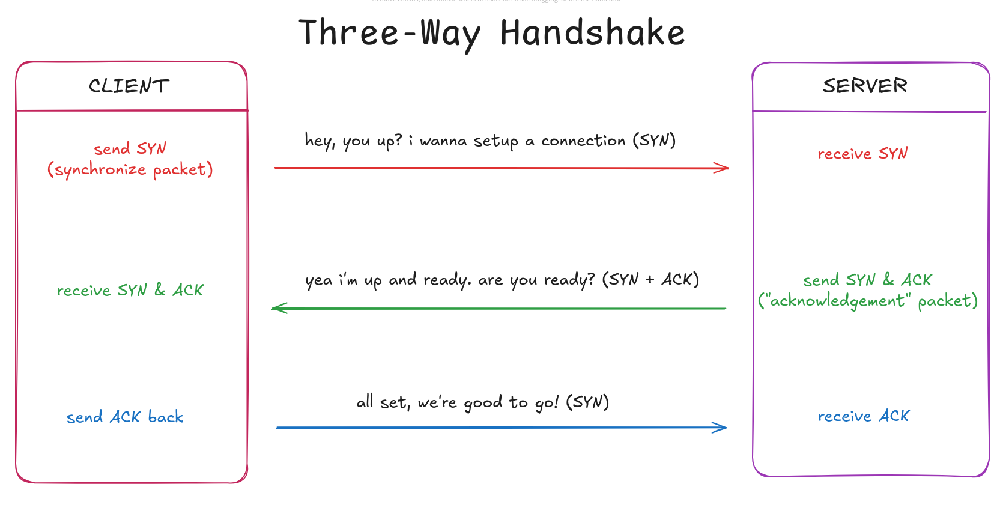

<!-- We discussed the basics of HTTP/TCP.
Went over the need for a DNS.
Understood the role of a server and the need for languages like GoLang to write a server that can listen to HTTP requests and respond as needed. -->

# Session 1: Networking Basics

We covered the fundamentals of HTTP and TCP, understanding how HTTP defines the rules for communication between clients and servers, while TCP ensures reliable data transmission. Next up we discussed the DNS[^1], which translates human-readable domains to IP addresses of the requested service. Without DNS we would have to remember numerical ip addresses for each and every websites we would ever want to visit.

Next, we explored Client-Server architecture and the importance of servers. Servers can be written in multiple languages like Javascript(using NodeJS), Java, Golang (which happens to be our choice of programming language for this cohort) and many more. Golang is a modern and easy to understand language using which developers can easily work with HTTP requests and respond to them properly.

## TCP

TCP remains on the Transport Layer[^2] of the OSI Model[^3]. It is built on top of Internet Protocol (IP)[^4]. Therefore, the entire suite is commonly referred as TCP/IP. TCP offers reliable, ordered and error-checked delivery of bytes between applications. TCP has major applications today such as world wide web, file transfers, email, etc.

### How does it works?

TCP is a connection-oriented protocol, meaning a connection between client and server needs to be established before any exchange of data can happen. TCP does this using three-way handshake procedure. Lets understand it.

<!--  -->

<picture>
  <source media="(prefers-color-scheme: dark)" srcset="./media/3wayhandshake-dark.png">
  <source media="(prefers-color-scheme: light)" srcset="./media/3wayhandshake-light.png">
  
</picture>

[^1]: https://howdns.works/
[^2]:
[^3]:
[^4]:
[^5]:
[^6]:
[^7]:
[^8]:
[^9]:
[^10]:
[^11]:
